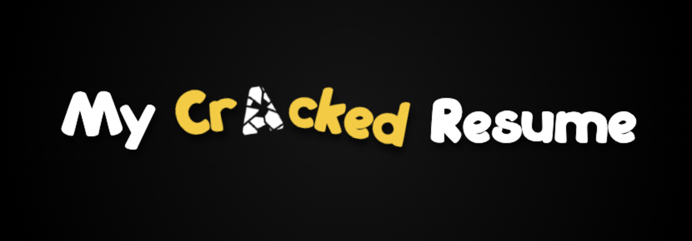
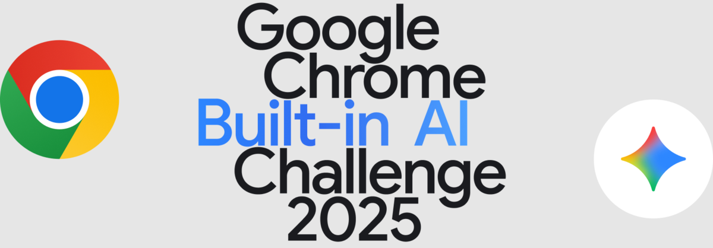

**Description:** A full-stack web application designed to help professionals—especially those in early to mid-level roles—track, manage, and grow their careers.

**⚠️ Important:** This application only works in a [Chrome](https://www.google.com/chrome) browser.

**Google APIs used in this project:**
- [Prompt API](https://developer.chrome.com/docs/ai/prompt-api) - This API was used as a way to reduce the amount of legacy interface. With language models, you can interface with apps and programs without navigating cluttered UI.
